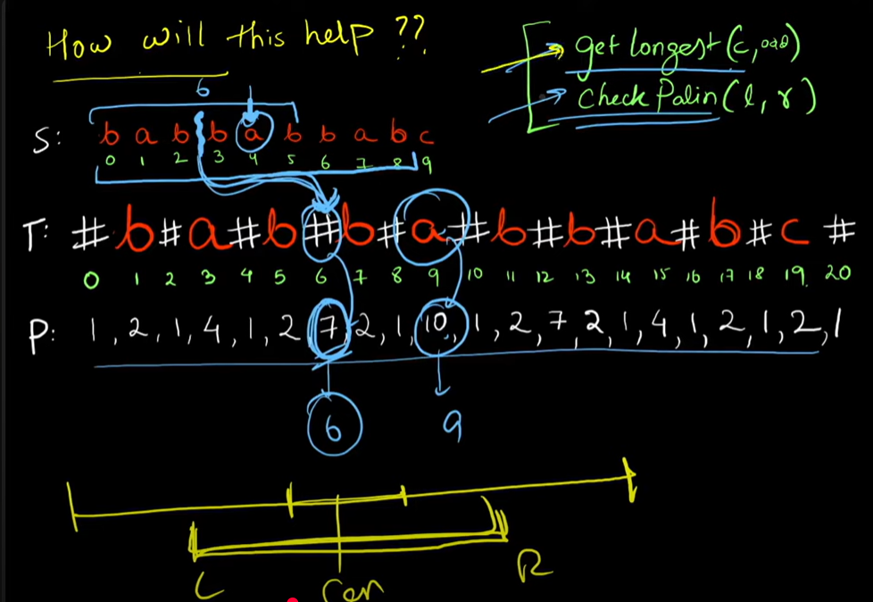

# Problem Statement
 Given a string s, return the longest palindromic substring in s.

# Example 1
    Input: s = "babad"
    Output: "bab"
    Explanation: "aba" is also a valid answer.

# Example 2
    Input: s = "cbbd"
    Output: "bb"    
    Explanation: "bb" is the longest palindromic substring.




# Brute force 
 ```java
  public class Solution {

    public String longestPalindrome(String s) {
        String res = "";
        int resLen = 0;

        // Check all possible substrings
        for (int i = 0; i < s.length(); i++) {
            for (int j = i; j < s.length(); j++) {
                int l = i, r = j;

                // Check if substring s[i..j] is a palindrome
                while (l < r && s.charAt(l) == s.charAt(r)) {
                    l++;
                    r--;
                }

                // If palindrome found and longer than previous one
                if (l >= r && resLen < (j - i + 1)) {
                    res = s.substring(i, j + 1);
                    resLen = j - i + 1;
                }
            }
        }

        return res;
    }
}
````