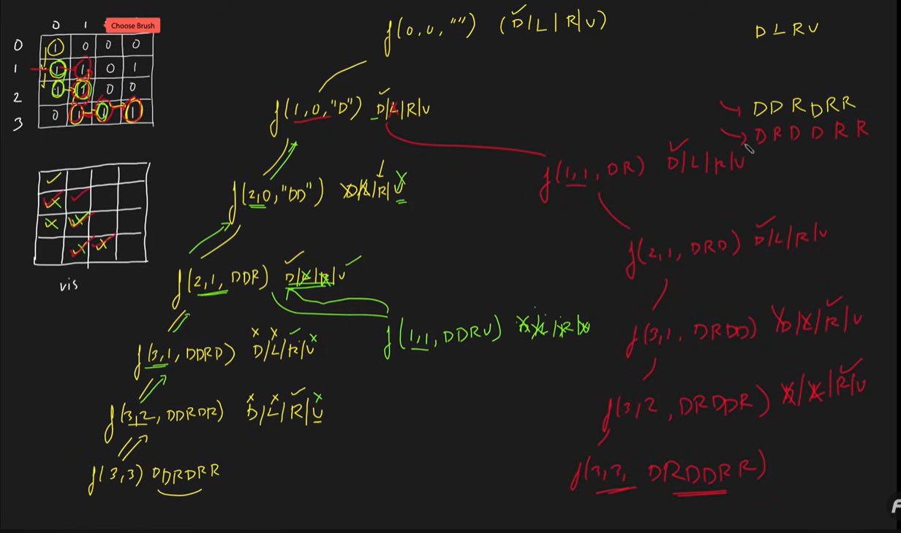

# Problem Statement
    Rat in a Maze
    Consider a rat placed at (0, 0) in a square matrix of order N * N. It has to reach the destination at (N - 1, N - 1). Find all possible paths that the rat can take to reach from source to destination. The directions in which the rat can move are 'U'(up), 'D'(down), 'L' (left), 'R' (right). Value 0 at a cell in the matrix represents that it is blocked and the rat cannot move to it while value 1 at a cell in the matrix represents that rat can travel through it.

# Example 1
    Input:
    N = 4
    m[][] = {{1, 0, 0, 0},
            {1, 1, 0, 1}, 
            {1, 1, 0, 0},
            {0, 1, 1, 1}}

    Output: DDRDRR DRDDRR
    Explanation: The rat can reach the destination at (3, 3) from (0, 0) by two paths - DDRDRR and DRDDRR, where D = Down, R = Right.

# Example 
    Input:
    N = 2
    m[][] = {{1, 0},
            {1, 0}}

    Output: -1
    Explanation: No path exists from source to destination.

# Recursion tree for Rat in a Maze
   

``` java 
import java.util.*;
// m is the given matrix and n is the order of matrix
class Solution {
  private static void solve(int i, int j, int a[][], int n, ArrayList < String > ans, String move,
    int vis[][]) {
    if (i == n - 1 && j == n - 1) {
      ans.add(move);
      return;
    }

    // downward
    if (i + 1 < n && vis[i + 1][j] == 0 && a[i + 1][j] == 1) {
      vis[i][j] = 1;
      solve(i + 1, j, a, n, ans, move + 'D', vis);
      vis[i][j] = 0;
    }

    // left
    if (j - 1 >= 0 && vis[i][j - 1] == 0 && a[i][j - 1] == 1) {
      vis[i][j] = 1;
      solve(i, j - 1, a, n, ans, move + 'L', vis);
      vis[i][j] = 0;
    }

    // right 
    if (j + 1 < n && vis[i][j + 1] == 0 && a[i][j + 1] == 1) {
      vis[i][j] = 1;
      solve(i, j + 1, a, n, ans, move + 'R', vis);
      vis[i][j] = 0;
    }

    // upward
    if (i - 1 >= 0 && vis[i - 1][j] == 0 && a[i - 1][j] == 1) {
      vis[i][j] = 1;
      solve(i - 1, j, a, n, ans, move + 'U', vis);
      vis[i][j] = 0;
    }
  }

  public static ArrayList < String > findPath(int[][] m, int n) {
    int vis[][] = new int[n][n];
    for (int i = 0; i < n; i++) {
      for (int j = 0; j < n; j++) {
        vis[i][j] = 0;
      }
    }

    ArrayList < String > ans = new ArrayList < > ();
    if (m[0][0] == 1) solve(0, 0, m, n, ans, "", vis);
    return ans;
  }
}

class Main {
  public static void main(String[] args) {

    int n = 4;
    int[][] a = {{1,0,0,0},{1,1,0,1},{1,1,0,0},{0,1,1,1}};

    Solution obj = new Solution();
    ArrayList < String > res = obj.findPath(a, n);
    if (res.size() > 0) {
      for (int i = 0; i < res.size(); i++)
        System.out.print(res.get(i) + " ");
      System.out.println();
    } else {
      System.out.println(-1);
    }
  }
}

```

# Problem to practice 
 https://www.geeksforgeeks.org/problems/rat-in-a-maze-problem/1

