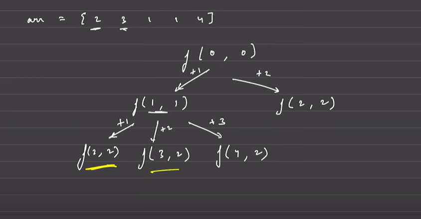

# problem Statement 
 - You are given a 0-indexed array nums of length n, where each element nums[i] represents the maximum jump length you can make forward from index i.

# Example 1
    Input: nums = [2,3,1,1,4]
    Output: 2
    Explanation: The minimum number of jumps to reach the last index is 2. Jump 1 step from index 0 to 1, then 3 steps to the last index.


# Example 2
   Input: nums = [2,3,0,1,4]
   Output: 2

# Jump Game II
  

```java
  class Solution {
    public int jump(int[] nums) {
        return func(0, nums);
    }

    private int func(int index, int[] arr) {
        int n = arr.length;
        if (index >= n - 1) {
            return 0;
        }

        if (arr[index] == 0) {
            return Integer.MAX_VALUE; // unreachable
        }

        int mini = Integer.MAX_VALUE;
        for (int i = 1; i <= arr[index]; i++) {
            int steps = func(index + i, arr); 
            if (steps != Integer.MAX_VALUE) {
                mini = Math.min(mini, 1 + steps);
            }
        }

        return mini;
    }
}
```

# Why this is Greedy
    - The algorithm explores all possible jumps from the current index and recursively calculates the minimum number of jumps needed to reach the end of the array.
    - At each position, it makes a greedy choice by trying all possible jumps and selecting the one that leads to the minimum number of total jumps.
    - This approach ensures that we are always considering the optimal path to reach the end of the array, making it a greedy solution.
  
  
# Time Complexity: O(2^n)
  - In the worst case, each position can jump to multiple positions, leading to an exponential number of recursive calls.


        

